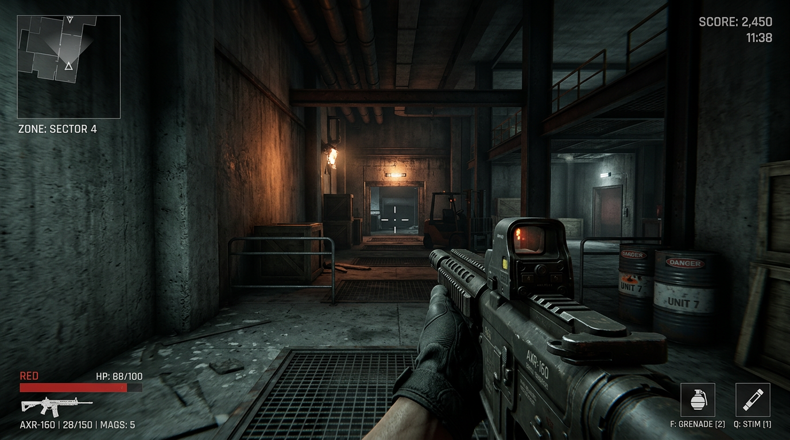

# My FPS Project

A personal 3D first-person shooter game built with Unity Engine. This project features character movement, weapon systems, grenades, and a modular character controller suitable for FPS gameplay.

---

## Overview

This is a personal first-person shooter developed in Unity. It includes:

- **First-person and third-person** player support with switchable camera prefabs
- **Weapon system** — reloadable rifles, bullet projectiles, and weapon assets
- **Grenades** — frag grenade logic and assets (e.g. CyberFrag)
- **Character system** — humanoid character with movement (ground/air), interaction modules, and inventory
- **Levels** — bootstrap and playground scenes with environment art and prefabs
- **Kinematic Character Controller** — custom movement and physics integration

The codebase is organized around scripts for player input, camera, HUD, weapons, characters, grenades, health, and level bootstrapping.

---

## Screenshots

In-game style preview (first-person view, AXR-160 rifle, playground environment):



*Screenshots from Unity Play mode can be added to the `Screenshots/` folder.*

---

## Requirements

| Requirement | Version / Notes |
|-------------|-----------------|
| **Unity** | 2023.2.15f1 (or compatible 2023.2 LTS) |
| **IDE** | Visual Studio integration included (optional) |

- Install [Unity Hub](https://unity.com/download) and add Unity **2023.2.15f1** (or the same editor version used by the project).
- The project uses **URP** (Universal Render Pipeline) and standard Unity modules (Physics, Animation, etc.).

---

## Getting Started

1. **Clone or download** this repository to your machine.
2. **Open in Unity Hub**  
   - Open Unity Hub → **Add** → select the folder containing the project.
3. **Open the project**  
   - Ensure the correct Unity version (2023.2.15f1) is used when opening.
4. **Run the game**  
   - In the Project window, open **Assets/Scenes/Playground/Playground.unity**.  
   - Press **Play** in the Unity Editor.

For a minimal bootstrap flow, you can also use the **Bootstrap** level asset if configured in your build or scene flow.

---

## Project Structure

```
Screenshots/              # In-game screenshots and preview images
Assets/
├── Characters/           # Character models, animations, and prefabs
│   ├── Swat Guy/         # Main character model, materials, prefab
│   └── Animations/       # Humanoid animations, locomotions, materials
├── Environment/          # Level art and environment prefabs
│   ├── Art/              # Textures and art assets
│   └── Prefabs/          # Walls, boxes, stairs, tunnels, environment prefabs
├── Grenades/             # Grenade assets (e.g. CyberFrag)
├── KinematicCharacterController/   # Third-party kinematic character controller
├── Levels/               # Level definitions (Bootstrap, Playground)
├── Player/
│   └── Resources/        # Player prefab, first-person and third-person camera prefabs
├── Scenes/
│   └── Playground/       # Main Playground scene and lighting settings
├── Scripts/              # C# game logic
│   ├── Characters/      # Character, movement, body, interaction, inventory, view
│   ├── Player/           # Player, camera, input, HUD, interaction, state
│   ├── Weapons/          # Weapon base, rifle, reloadable, bullets, ammo
│   ├── Grenade/          # Grenade and frag grenade logic
│   ├── Physics/          # Projectiles, bullet/rigidbody projectiles
│   ├── Levels/           # Bootstrap and level initialization
│   ├── Extensions/       # Vector3, Float, Array, Gizmos extensions
│   ├── Attributes/       # Custom attributes (e.g. ReadOnly, Label)
│   ├── Utilities/        # State machine, VectorBool, editor utilities
│   ├── Registry/         # Asset and object registries
│   ├── Playables/        # Animation blend trees
│   └── Heallth/          # Health system
├── Weapon Bullets/       # Bullet assets and prefabs (e.g. Heavy)
└── Weapons/              # Weapon models and assets (e.g. AXR-160)
```

---

## Features in Detail

### Player

- **PlayerBehaviour** — Core player logic and state.
- **PlayerInputs** — Input handling for movement and actions.
- **PlayerCamera** — Camera control (first/third person).
- **PlayerHUD** — In-game HUD.
- **PlayerInteraction** — Interaction with world objects (e.g. weapons).

### Weapons

- **Weapon / ReloadableWeapon / RifleWeapon** — Base and rifle weapon behaviour.
- **WeaponBullet / WeaponAmmo** — Bullet and ammo logic.
- **FireableWeapon / RechargeableWeapon** — Firing and recharge patterns.
- **AXR-160** — Example rifle asset with prefab and materials.

### Characters

- **Character / CharacterBody / CharacterBehaviour** — Character core and presentation.
- **CharacterMovement** — Ground and air movement modules.
- **CharacterInteraction** — Interaction modules (e.g. reloadable weapon).
- **CharacterInventory / CharacterView** — Inventory and view logic.

### Grenades

- **Grenade / FragGrenade** — Base grenade and frag behaviour.
- **CyberFrag** — Example grenade asset.

### Levels

- **BootstrapLevel / TrainingLevel** — Level bootstrap and training level setup.
- **Playground** — Main playable scene.

---

## Controls (typical)

Controls are defined in the project’s Input settings and in **PlayerInputs**. Common defaults (check in Unity):

- **WASD** — Move  
- **Mouse** — Look  
- **Left click** — Fire  
- **R** — Reload (for reloadable weapons)  
- **Interaction key** — Use/pickup (when implemented)

Exact bindings may differ; refer to **Edit → Project Settings → Input** and the **PlayerInputs** script.

---

## License

See the **LICENSE** file in this repository for terms of use. Third-party assets (e.g. KinematicCharacterController) may have their own licenses under `Assets/` or in their folders.

- Fix incorrect type hint that was causing mypy to fail in CI

- Implement a simple metrics endpoint for Prometheus scraping
